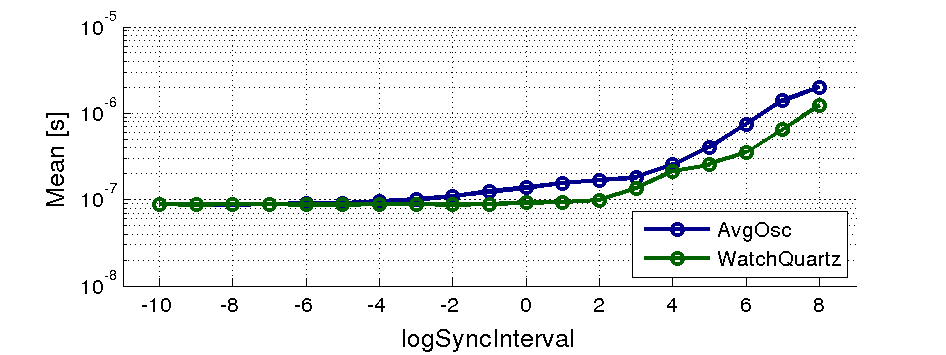
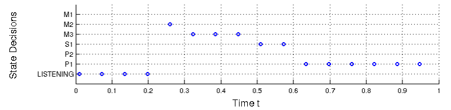
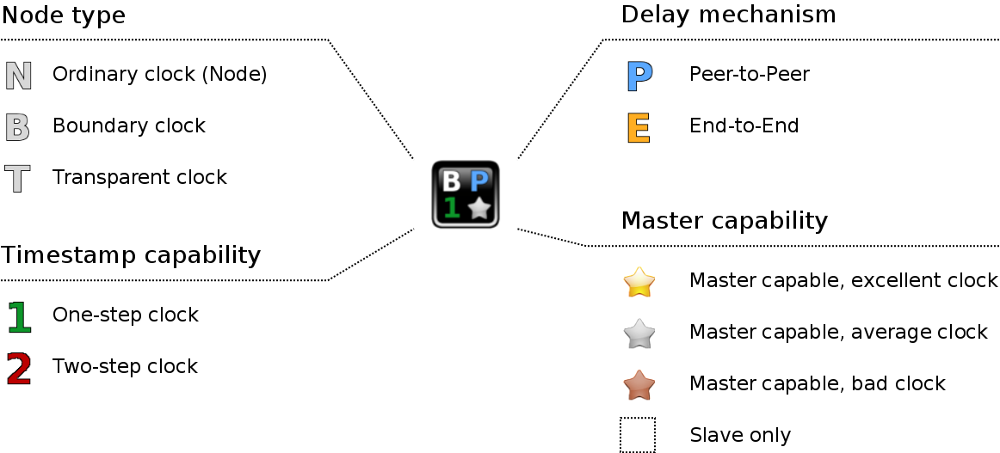
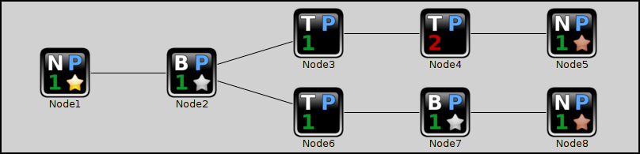
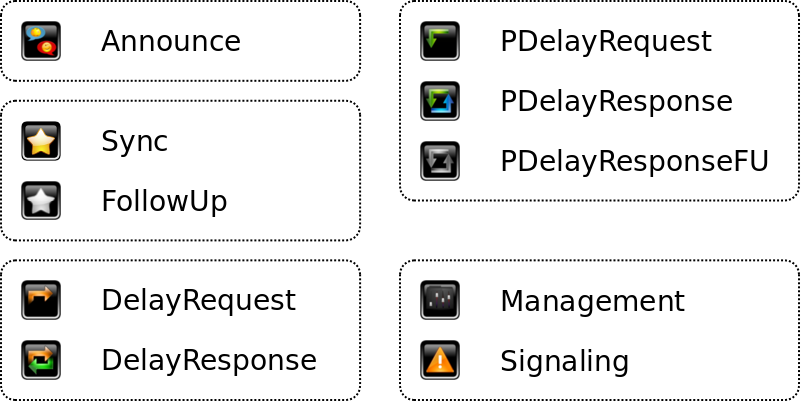

LibPTP: A Library for PTP Simulation
==============================================================

Project relationship
-------------------------------

This project is part of the **ptp-sim** project.
See the [ptp-sim project page](https://ptp-sim.github.io/) for more information.
There is also the [ptp-sim discussion forum](http://ptp-sim.boards.net) for further discussions.

Project description
-------------------------------

LibPTP is an OMNeT++ libary to support simulation of the **Precision Time Protocol (PTP)** as it is specified in IEEE 1588-2008 in the simulation framework [OMNeT++][1].
LibPTP uses models of standard network components from the [INET][2] library, and extends them with PTP functionality.

This library is one of the outcomes of the master thesis _Simulation of Time-synchronized Networks using IEEE 1588-2008_, published at the University of Technology in 2016.

The current version of this library can be found on [Github][3].

Feature list of LibPTP:

* Models for Ordinary, Boundary and Transparent Clocks
* Support for both End-to-End (E2E) as wells as Peer-to-Peer (P2P) delay measurement
* Debugging and tracing support
* Suport for PTP/Ethernet as specified in Annex F of IEEE 1588-2008
* A model for a PI clock servo, and support for implementing custom clock servos
* Support for different kinds of filters
* __Realistic clock noise__ can optionally be provided by using [LibPLN][4], a library for efficient powerlaw noise generation.

[1]: https://omnetpp.org/
[2]: https://inet.omnetpp.org/
[3]: https://github.com/ptp-sim/libPTP
[4]: https://github.com/ptp-sim/libPLN

Project overview
-------------------------------

The goal of LibPTP is it to provide an easy to use simulation tool for PTP networks.
OMNeT++ was chosen as the development environment because it provides a powerful tool with support for all stages of simulation development, from inital model design to carrying out sophisticated parameter studies.

For an example for what is possible with LibPTP see the following image, which shows a parameter study for the sync interval:

The images shows the mean offset value of a PTP slave node that is directly connected to its master, depending on the configured sync interval.
The same simulation was carried out with two different oscillators, and LibPTP allows to study the behavior of each of them.

Other advantages of LibPTP are its sophisticated debugging and tracing capabilities.
For example, it is easy to trace all state decisions of a PTP node, as shown in the following image:

Additionally, it would be possible to log every single step during the Best Master Clock Algorithm (BMCA) or the dataset comparison algorithm.

Example PTP Simulations
-------------------------------

The LibPTP repository contains only the actual simulation model for PTP nodes.
It does not contain any simulatons networks.
Example simulations can be found in the [PTP Simulations][10] repository.

[10]: https://github.com/ptp-sim/PTP_Simulations

Node Symbols
-------------------------------

OMNeT++ provides a powerful Graphical User Interface (GUI).
To make full use of it, LibPTP uses custom icons for all PTP related models.

__PTP Nodes:__

The example components that come with LibPTP use an icon scheme to visualize their attributes:

The node icons have a symbol in each corner:
* __Upper left:__ Node type
    * N = End node (Ordinary Clock)
    * B = Boundary Clock
    * T = Transparent Clock

* __Upper right:__ Delay mechanism
    * P = Peer-to-Peer (P2P)
    * E = End-to-End (E2E)

* __Lower left:__ Timestamping capability
    * 1 = 1-step clock (on-the-fly timestamps)
    * 2 = 2-step clock

* __Lower right:__ Clock attributes for Best Master Clock Algorithm (BMCA)
    * Golden star: Excellent clock attributes, such a node will prefer its ports to be passive rather than slave
    * Silver star: Average clock attributes, such a clock will loose in the BMCA against a clock with a golden star
    * Brozne star: Bad clock attributes, such a clock will loose in the BMCA against a clock with a silver star
    * No icon: Slave only

The image in the center shows a boundary clock, with P2P delay mechanism, which is 1-step capable and has average clock attributes.

__Example network:__

The folloing image shows an example network to visualize the example icons used by LibPTP:

All nodes in this PTP network use the P2P delay mechanism (blue P).
The left-most node is a 1-step capable (1) ordinary clock (N) with excellent clock attributes (golden star).
It is connected to a 1-step capable boundary clock (B) with average clock attributes (silver star).
The boundary clock is connected to two daisy chains on the right.
The upper chain consists of two slave-only (no icon) transparent clocks (T), where the second one is only 2-step capable (2), followed by an ordinary clock with bad clock attributes.
The lower chain consists of a transparent, a boundary and an ordinary clock.

As only one clock has a golden star, we can safely assume that it will win the BMCA and become the grand master of the PTP network.

__PTP Messages:__

As with the PTP nodes, LibPTP also provides custom icons for PTP messages:

_Remark:_ While icons for Management and Signaling messages are provided, these two message types are currently not implemented.

Project structure
-------------------------------

The _src_ directory contains most of the project relevant contents.
It is structured as follwos: Most of the individual parts of a PTP system are loosely grouped into the folders _Hardware_, _Firmware_ and _Sotware_.
These individual parts are then plugged together to form network components, which are placed in the _Components_ directory.
The _Utils_ folder contains generic utilities.

The other directories are the following:

* `doc:` Documentation for the project, mainly doxygen generated files.
* `Docs:` Various documents, mainly related to measurement results.
* `images:` The image files for the OMNeT++ models.
* `Tools:` This the place for generic tools like shell scripts.

Documentation format
-------------------------------

The documentation files in this repository are written in [Markdown][20] (line ending *.md).
They can be either read in a text editor, are converted to HTML using the markdown utility.

[20]: https://daringfireball.net/projects/markdown/

Usage
-------------------------------

__Documentation:__

* Doxygen files can be found in the _doc_ directory
* The _Docs_ directory contains various files with additional information (e.g. how to use LibPTP together with LibPLN)
* Both LibPLN and LibPTP have been developed as part of the following master thesis:

_Wolfgang Wallner_, __Simulation of Time-synchronized Networks using IEEE 1588-2008__, 2016, Vienna University of Technology

Persistent URL: https://resolver.obvsg.at/urn:nbn:at:at-ubtuw:1-3908

This document contains an in-depth description on the various design decitions of both libraries.

__Supported platforms:__

LibPTP has been tested on Linux (Kubuntu 16.04) and Windows 7.
Non-Portable libraries have been avoided, thus it is likely that it will work (maybe with small adjustments) also on other platforms.

__Requirements:__

* The [Boost C++ library][30]
* The [OMNeT++ simulation framework][31], in version 4.6
* The [INET library][32], in version 2.6
* The [OMNeT_Utils project][33]
* (optionally) The [LibPLN library][34], for realistic clock noise

[30]: http://www.boost.org/
[31]: https://omnetpp.org/omnetpp/category/30-omnet-releases
[32]: https://inet.omnetpp.org/Download.html
[33]: https://github.com/ptp-sim/OMNeT_Utils
[34]: https://github.com/ptp-sim/libPLN

__Getting started:__

* Install OMNeT++ 4.6 and INET 2.6
* Install the Boost C++ library on your system
* Get the _OMNeT Utils_ repository, and add it into your OMNeT++ workspace
* Get _LibPTP_, and import it into your OMNeT++ workspace
* Create a new OMNeT++ project, and add LibPTP as a project reference
    * You can now use PTP nodes in your network simulation
    * For an example on how to create PTP simulation networks, have a look at the example simulations in the _PTP Simulations_ repository
* (Optional) Install LibPLN, and provide information about its installation in the provided _makefrag_ file
    * This enables you to simulate network nodes with realistic clock noise, and thus makes PTP simulations more plausible

Credits
-------------------------------

The implementation of LibPTP would not have been possible without the availability of the following components:

* The [Buttonized icon theme][40]
* The [OMNeT++ simulation framework][41]
* The [INET library][42], which provides a large set of models for standard network components
* The [Boost C++ library][43]

[40]: http://kde-look.org/content/show.php/?content=161553
[41]: https://omnetpp.org/
[42]: https://inet.omnetpp.org/
[43]: http://www.boost.org/

License
-------------------------------

Most parts of this project are licensed under the _GPLv3 license_. See the _COPYING_ file for details.

As stated, the icons used by LibPTP are based on the _Buttonized_ icon theme, which is licensed unter the _GPLv2 license_.
The images of LibPTP keep this license, and are thus also licensed unter the _GPLv2 license_. See the _images/LICENSE.txt_ file for details.

Contact
-------------------------------

Please visit the [ptp-sim discussion forum](http://ptp-sim.boards.net) for further discussions.
